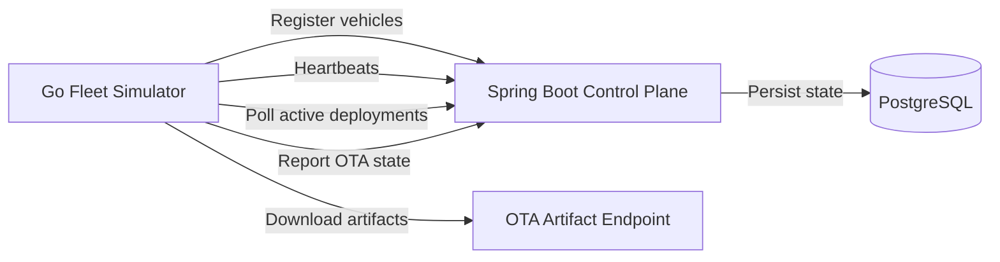

# Heimdall

[](https://github.com/filip-labs/Heimdall/actions/workflows/ci.yml)
[](LICENSE)

Heimdall is a connected-vehicle OTA control plane and fleet simulator built to explore reliable software delivery to software-defined vehicles.

## Overview

Heimdall has two main parts:

- A Spring Boot control plane that stores vehicle, release, deployment, event, and rollout state in PostgreSQL.
- A Go fleet simulator that runs many autonomous vehicle agents in one process.

The control plane exposes REST APIs for registering vehicles, receiving heartbeats, creating software releases, deploying releases to vehicles, and orchestrating staged fleet rollouts. The simulator registers deterministic VINs, sends heartbeats, polls for active deployments, downloads OTA artifacts, verifies SHA-256 checksums, and reports deployment status back to the API.

## Why Heimdall Exists

Deploying vehicle software is not simply uploading a file. An OTA platform must account for intermittent connectivity, durable state, integrity checks, resumability, retries, staged rollout, blast radius control, health gates, and auditability.

Heimdall models those concerns in a compact project that is suitable for engineering discussion, local experimentation, and portfolio review.

## Current Architecture



The Spring Boot application uses package-by-domain organization:

```text
src/main/java/dev/heimdall/
├── HeimdallApplication.java
├── deployment/
├── release/
├── rollout/
└── vehicle/
```

The Go simulator stays in one Go package while splitting responsibilities across files:

```text
simulator/
├── artifact_downloader.go
├── client.go
├── config.go
├── fleet.go
├── main.go
├── ota.go
├── vehicle_agent.go
└── vin.go
```

## Core Domains

- `Vehicle`: registered vehicle identity, software version, connectivity status, and heartbeat timestamps.
- `SoftwareRelease`: release version, artifact URL, checksum, and metadata.
- `Deployment`: a single vehicle OTA attempt for one release.
- `DeploymentEvent`: immutable audit record of deployment status transitions.
- `Rollout`: orchestration record for deploying one release to a snapshot of eligible vehicles.
- `RolloutStage`: cumulative rollout stage such as 5%, 25%, 50%, or 100%.
- `RolloutTarget`: immutable rollout membership snapshot ordered by VIN.

## OTA Lifecycle

Deployments progress through this state machine:

```text
PENDING
↓
DOWNLOADING
↓
DOWNLOADED
↓
INSTALLING
↓
INSTALLED
```

A deployment can move to `FAILED` from any non-terminal state when artifact download, checksum verification, or another OTA step fails. Repeated reports of the current status are idempotent, and each real transition creates a deployment event.

## Reliability

Heimdall currently includes:

- SHA-256 artifact verification before install.
- Transient artifact download retry with exponential backoff.
- Retry only for request-level transient errors and HTTP 5xx gateway/server failures.
- Source software version snapshot on deployment creation.
- Idempotent status updates from vehicle agents.
- Deployment event audit trail.
- Vehicle restart/reuse by deterministic VIN.
- Staged rollout with target snapshots and health gates.
- Operator-controlled rollout pause, resume, and cancel.
- Pessimistic database locking for rollout stage advancement.

## Fleet Simulation

Run the simulator after the control plane is available:

```bash
cd simulator
FLEET_SIZE=100 go run .
```

Useful environment variables:

```text
HEIMDALL_URL=http://localhost:8080
FLEET_SIZE=100
INITIAL_SOFTWARE_VERSION=1.3.0
HEARTBEAT_INTERVAL=5s
DEPLOYMENT_POLL_INTERVAL=3s
SIMULATED_FAILURE_VINS=7FC00000000000003
```

The simulator generates deterministic VINs, registers or reuses existing backend vehicles, sends heartbeats, polls for active deployments, processes OTA artifacts, and shuts down cleanly on `SIGINT` or `SIGTERM`.

`SIMULATED_FAILURE_VINS` is an optional comma-separated VIN list for deterministic OTA installation failures. Targeted vehicles still download the artifact, verify its SHA-256 checksum, report `DOWNLOADED`, report `INSTALLING`, then report `FAILED` with `simulated installation failure` while keeping their previous software version.

## Staged Rollouts

Rollouts deploy one software release to the current eligible fleet in cumulative stages:

```text
5% -> 25% -> 50% -> 100%
```

For 100 target vehicles this means:

```text
5
+20
+25
+50
=100
```

Rollout targets are selected once at creation time from vehicles not already running the target release version, ordered by VIN ascending. Vehicles registered later are not added to the rollout.

Each stage creates deployments only for the incremental cohort. When all deployments in the current stage are terminal, Heimdall evaluates that stage's failure rate. If the failure rate is greater than the configured threshold, the current stage is marked `FAILED` and the rollout is `PAUSED`. If the failure rate is less than or equal to the threshold, the rollout advances to the next stage or completes.

Operators can pause, resume, or cancel a rollout with `POST /api/v1/rollouts/{id}/pause`, `POST /api/v1/rollouts/{id}/resume`, and `POST /api/v1/rollouts/{id}/cancel`. Pause and cancel stop future rollout progression without modifying existing deployments. Cancel is permanent and does not roll back already-installed vehicles.

A manual demo can validate the health gate by configuring one canary to fail deterministically:

```bash
cd simulator
FLEET_SIZE=100 \
INITIAL_SOFTWARE_VERSION=2.0.0 \
SIMULATED_FAILURE_VINS=7FC00000000000003 \
go run .
```

With rollout stages `[5,25,50,100]` and a 5% failure threshold, VIN `7FC00000000000003` fails in the canary cohort, stage 0 pauses the rollout, and no deployments are created for stage 1.

## API Overview

Primary endpoint groups:

```text
/api/v1/vehicles
/api/v1/releases
/api/v1/deployments
/api/v1/rollouts
```

The Postman collection in `postman/Heimdall.postman_collection.json` covers the main vehicle, release, deployment, rollout, and health-check workflows. `postman/Local.postman_environment.json` targets `http://localhost:8080`.

## Technology Stack

- Java 21
- Spring Boot 4.1.1
- Maven
- PostgreSQL 17
- Flyway
- JPA/Hibernate
- Testcontainers
- Go
- Docker Compose
- Postman

Kafka, Prometheus, Grafana, Redis, and rollback orchestration are roadmap items, not implemented features.

## Running Locally

Start PostgreSQL:

```bash
docker compose up -d
```

The local database is exposed as:

```text
localhost:5433 -> container:5432
database: heimdall
username: heimdall
password: heimdall
```

Start the Spring Boot control plane:

```bash
./mvnw spring-boot:run
```

Start the simulator:

```bash
cd simulator
FLEET_SIZE=100 go run .
```

## Tests

Run the Java tests:

```bash
./mvnw test
```

Run the Go simulator tests:

```bash
cd simulator
go test ./...
go test -race ./...
```

## Project Structure

```text
.
├── compose.yaml
├── postman/
├── simulator/
├── src/main/java/dev/heimdall/
│   ├── deployment/
│   ├── release/
│   ├── rollout/
│   └── vehicle/
├── src/main/resources/
│   ├── application.yml
│   ├── db/migration/
│   └── static/artifacts/
└── src/test/java/dev/heimdall/
    ├── deployment/
    ├── integration/
    └── rollout/
```

## Engineering Decisions

- PostgreSQL stores durable vehicle, deployment, event, and rollout state.
- Flyway migrations are immutable once created.
- Deployment state transitions are protected by the `Deployment` entity.
- Deployment creation captures the source software version before OTA begins.
- Manual and rollout-created deployments share the same deployment creation path.
- Rollouts snapshot target membership and persist deterministic VIN ordering.
- Rollout stage advancement uses pessimistic locking on the rollout row.
- Stage health is calculated against the current stage's incremental cohort.
- Artifact integrity is verified before install.
- Simulator retries are limited to transient request errors and retryable HTTP statuses.

## Project Resources

- [Heimdall Roadmap](https://github.com/users/filip-labs/projects/4/views/1)
- [GitHub Issues](https://github.com/filip-labs/Heimdall/issues)
- [Postman API collection](postman/Heimdall.postman_collection.json)
- [Architecture overview](#current-architecture)

## Roadmap

```text
M1 Single Vehicle OTA                                Done
M2 Connectivity + Agent                              Done
M3 Artifact Integrity                                Done
M4 Reliability + Audit                               Done
M5 Fleet Simulator                                   Done
M6A Staged Fleet Rollouts                            Done
M6B Deterministic Failure Injection + Pause Demo     Done
M7A Manual Rollout Controls                          Done
M7B Rollback Deployments                             Next
M7C Automatic Rollback Policy
M8 Observability
M9 Kafka / Event-driven Architecture
M10 Scalability Testing
M11 Security
M12 Infrastructure + CI
M13 Operator Dashboard
M14 Documentation + Final Demo
```

## Scope

Heimdall is an engineering and portfolio simulation. It is not production automotive firmware infrastructure and does not implement the full safety, cybersecurity, certification, operational, or regulatory requirements of a real OEM OTA platform.
